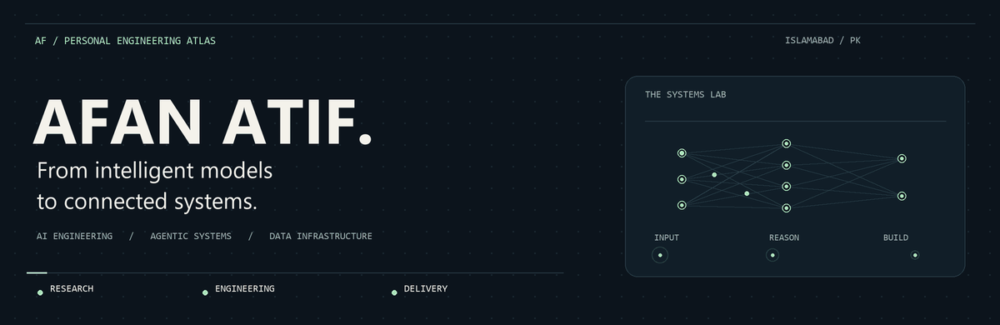
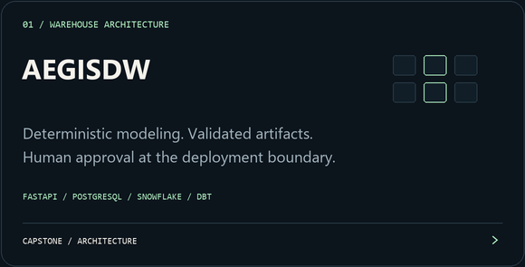
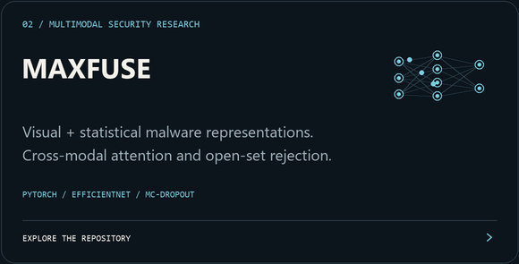
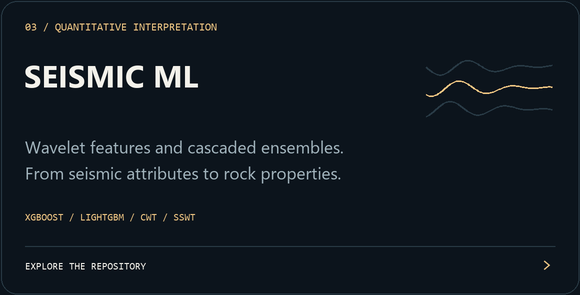
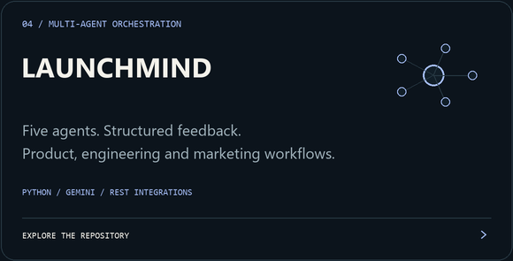
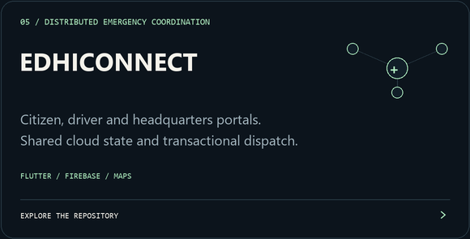
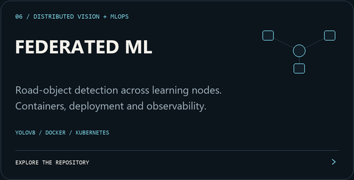
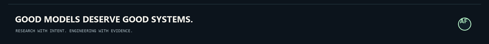

  <picture>
    <source media="(prefers-reduced-motion: reduce)" srcset="assets/hero.png">
    
  </picture>

  <strong>AI/ML Engineer · Agentic Systems · Multimodal Learning · Data Infrastructure</strong> 
  Final-year BS Artificial Intelligence at <strong>FAST-NUCES, Islamabad</strong>

  
  &nbsp;
  

  <a href="#the-engineering-focus">Focus</a> &nbsp; / &nbsp;
  <a href="#selected-work">Selected work</a> &nbsp; / &nbsp;
  <a href="#experience">Experience</a> &nbsp; / &nbsp;
  <a href="#the-toolkit">Toolkit</a> &nbsp; / &nbsp;
  <a href="#more-from-the-lab">More projects</a>

---

## The engineering focus

I'm **Afan Atif**, an AI/ML engineer based in Islamabad. I work where model research meets software architecture: multimodal classification, uncertainty-aware learning, agentic orchestration, data-warehouse modeling and the services that connect them.

My projects span malware analysis, seismic interpretation, language understanding, distributed learning and humanitarian coordination. I care about the whole path: how data enters a system, how decisions are checked, and how the resulting software can be operated and evaluated.

<table>
<tr>
<td valign="top" width="33%">

<strong>01 / Intelligent models</strong>

Cross-modal attention, uncertainty estimation, open-set recognition, structured NLP and signal-driven predictive pipelines.

</td>
<td valign="top" width="33%">

<strong>02 / Coordinated agents</strong>

Task decomposition, structured message flows, step-level verification and human approval around important decisions.

</td>
<td valign="top" width="33%">

<strong>03 / Connected systems</strong>

APIs, dimensional warehouses, containerized ML workflows and distributed client/cloud coordination.

</td>
</tr>
</table>

## Selected work

Six projects that show the range of my engineering work.

<table>
<tr>
<td valign="top" width="50%">

<strong>AegisDW · Capstone</strong> 
I lead the architecture of a warehouse-modeling assistant, with input parsing, semantic classification, logical/physical modeling, validated DDL and dbt artifacts, and approval gates.

<a href="mailto:i220503@nu.edu.pk?subject=AegisDW%20architecture">Discuss the architecture ↗</a>
</td>
<td valign="top" width="50%">

<strong>MAXFUSE · Security + deep learning</strong> 
Visual and statistical malware representations meet through cross-modal attention, with uncertainty-aware fusion and an energy-based gate for unknown samples.

<a href="https://github.com/afanatif/maxfuse-multimodal-malware-classifier">Explore MAXFUSE ↗</a>
</td>
</tr>
<tr>
<td valign="top" width="50%">

<strong>Seismic interpretation · Applied ML</strong> 
My LMKR work connects seismic attributes, well-tie calibration, CWT/SSWT features and cascaded ensemble models to petrophysical and elastic-property prediction.

<a href="https://github.com/afanatif/quantitative-seismic-interpretation-ml">Explore the project ↗</a>
</td>
<td valign="top" width="50%">

<strong>LaunchMind · Agentic orchestration</strong> 
CEO, Product, Engineer, Marketing and QA agents coordinate through a JSON message bus, feedback loops and integrations with GitHub, Slack and email services.

<a href="https://github.com/afanatif/launchmind-multi-agent-startup">Explore LaunchMind ↗</a>
</td>
</tr>
<tr>
<td valign="top" width="50%">

<strong>EdhiConnect · Distributed coordination</strong> 
Emergency and welfare workflows across citizen, driver and HQ clients: cloud-backed identity, ambulance assignment, transactional dispatch, map selection and image-backed reports.

<a href="https://github.com/afanatif/Edhi_fyp">Explore EdhiConnect ↗</a>
</td>
<td valign="top" width="50%">

<strong>Federated vision · MLOps</strong> 
Road-object detection with YOLOv8 and learning across distributed nodes, supported by containerization, CI/CD and monitoring tools.

<a href="https://github.com/afanatif/federated-road-detection-mlops">Explore the pipeline ↗</a>
</td>
</tr>
</table>

## Experience

<table>
<tr>
<td valign="top" width="50%">

<strong>Machine Learning Intern · LMKR</strong> 
July 2026

Quantitative seismic interpretation: physics-calibrated well ties, wavelet-based feature engineering, cascaded ensemble models and blind-well evaluation.

</td>
<td valign="top" width="50%">

<strong>Backend Development Intern · Codematics</strong> 
November–December 2025

Node.js/Express APIs, Socket.IO communication, MongoDB schema design, validation and services organized around MVC.

</td>
</tr>
</table>

## The toolkit

| Area | Tools and methods |
| --- | --- |
| **Languages** | Python · C++ · JavaScript · SQL · Dart · TypeScript |
| **Deep learning & vision** | PyTorch · TensorFlow · EfficientNet · YOLOv8 · cross-modal attention · MC-Dropout · energy-based OOD |
| **Classical ML & signals** | scikit-learn · XGBoost · LightGBM · Random Forest · stacking · CWT/SSWT |
| **Agents & language** | Gemini API · Hugging Face · structured orchestration · step-gated verification · BERT/CRF · FLAN-T5 · Sentence-BERT · spaCy |
| **Data engineering** | PostgreSQL · Snowflake · dbt-core · dimensional modeling · Kimball methodology · MongoDB · MySQL |
| **APIs & applications** | FastAPI · Pydantic · Node.js · Express · Socket.IO · React/Next.js · Flutter · Firebase |
| **MLOps & observability** | Docker · Kubernetes · Kubeflow · GitHub Actions · Prometheus · Grafana |

## More from the lab

| Project | Engineering thread |
| --- | --- |
| [**Awaaz**](https://github.com/afanatif/Awaaz) | Multi-source claim analysis, contradiction reasoning, bilingual summaries and an auditable agent pipeline |
| [**PathAgent**](https://github.com/afanatif/Pathagent) | Uncertainty-guided multiple-instance learning for colorectal tissue classification |
| [**SGVI MediPlan**](https://github.com/afanatif/sgvi-mediplan-llm-planning-agent) | Step-gated verification, incremental correction and constraint-aware LLM planning |
| [**Aspect Sentiment Triplet Extraction**](https://github.com/afanatif/aspect-sentiment-triplet-extraction) | Unified BERT–CRF tagging, contrastive augmentation and exact-match triplet evaluation |
| [**Transformers + RAG**](https://github.com/afanatif/nlp-transformers-rag-pipeline) | Encoder–retriever–decoder pipeline over product reviews |
| [**MenopaAI**](https://github.com/afanatif/menopaai-health-platform) | ML-backed health assessment interface with explanations, bilingual presentation and PDF reports |
| [**ApiCrawler**](https://github.com/afanatif/ApiCrawler) | OpenAPI discovery, conditional fetching, content-hash versioning and a local specification catalogue |
| [**Golearnix**](https://github.com/afanatif/golearnix) | Next.js, React and TypeScript application development |

  <a href="https://github.com/afanatif?tab=repositories"><strong>Browse my public repositories ↗</strong></a>

## Let's build something useful

I'm open to **AI/ML engineering and software engineering opportunities**, research collaboration and thoughtful conversations about agents, models and data systems.

Reach me on [LinkedIn](https://www.linkedin.com/in/afan-atif-338676363/) or at [i220503@nu.edu.pk](mailto:i220503@nu.edu.pk).

  

<!-- Original artwork is generated by tools/build_profile_assets.py.
     The motion-reduced header is assets/hero.png. -->
